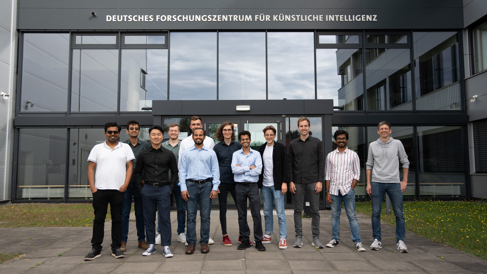
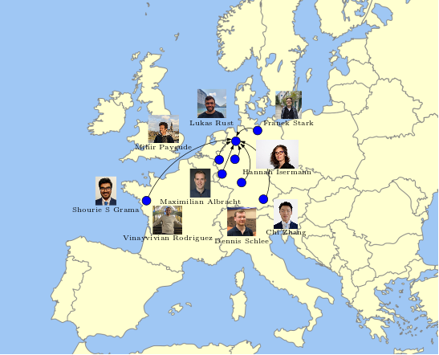

# Event Summary

The [Underactuated Lab](https://robotik.dfki-bremen.de/en/research/research-facilities-labs/underactuated-lab/) at [DFKI Robotics Innovation Center](https://robotik.dfki-bremen.de/en/startpage.html) is committed to pushing the limits of our robots to achieve animal-like physical/athletic intelligence. Our lab generally hosts a group of exchange students every summer with diverse backgrounds from all over Europe with a shared vision of developing athletic intelligence for underactuated robotic systems (for example, the last year’s proceedings/videos can be found [here](https://dfki-ric-underactuated-lab.github.io/summer_of_underactuation_2022/)). The Summer of Underactuation 2023 event continues this tradition from last year and intends to highlight the scientific work of the exchange students working with the underactuated lab to everyone working at DFKI-RIC. We would like to invite you to join us over lunchtime on **29 September 2023 (Friday) from 12:00 to 16:00 in the B0.10 seminar room** to enjoy monkey-like brachiation movements, parkour with monopods, the latest insights into reinforcement learning for achieving dynamic movements, controllers for floating robots in space and in water, and understanding hybrid rovers.

| Time Slot      | Title of the presentation                                                                       | Speaker              |
|----------------|-------------------------------------------------------------------------------------------------|----------------------|
| 12:00 - 12:15  | [Underactuated Lab Introduction](#underactuated-lab-introduction-by-dr-shivesh-kumar)                                           | Dr. Shivesh Kumar |
| 12:15 - 12:30  | [Foreword: Summer of Underactuation 2023](#foreword-summer-of-underactuation-2023-by-shubham-vyas)             | Shubham Vyas    |
| 12:30 - 12:35  | [Reinforcement Learning Based Underactuated control of double pendulum](#reinforcement-learning-based-underactuated-control-of-double-pendulum-by-chi-zhang)                            | Chi Zhang         |
| 12:35 - 12:40  | [Analytical Inverse Kinematics of a 6R-U-S Parallel Kinematic Mechanism](#analytical-inverse-kinematics-of-a-6r-u-s-parallel-kinematic-mechanism-by-vinayvivian-rodrigues)                                                | Vinayvivian Rodrigues         |
| 12:40 - 12:45  | [Trajectory Optimization and Stabilization for Underactuated AUVs](#trajectory-optimization-and-stabilization-for-underactuated-auvs-by-lukas-rust)                  | Lukas Rust    |
| 12:45 - 12:50  | [Control Strategies for a Rimless Wheel Micro-Rover](#control-strategies-for-a-rimless-wheel-micro-rover-by-dennis-schlee) | Dennis Schlee          |
| 12:50 - 12:55  | [Control of Dynamic Parkour Motions for a Hopping Leg on a Broomstick](#control-of-dynamic-parkour-motions-for-a-hopping-leg-on-a-broomstick-leg-by-maximilian-albracht)                                                      | Maximilian Albracht          |
| 12:55 - 13:00  | [Mechatronic design and control of an underactuated 3-link brachiation robot ](#mechatronic-design-and-control-of-an-underactuated-3-link-brachiation-robot-by-shourie-grama-srinivas)       | Shourie Grama Srinivas     |
| 13:00 - 13:05  | [Skidy – a new tool for closed form solution of the equations of motion for open chain robots](#skidy-–-a-new-tool-for-closed-form-solution-of-the-equations-of-motion-for-open-chain-robots-by-hannah-isermann)                                            | Hannah Isermann      |
| 13:05 - 13:10  | [A Recursive Lie-Group Formulation for the Second-Order Time Derivatives of the Inverse 	Dynamics of Parallel Kinematic Manipulators](#a-recursive-lie-group-formulation-for-the-second-order-time-derivatives-of-the-inverse-dynamics-of-parallel-kinematic-manipulators-by-mihir-paygude)                                | Mihir Paygude |
| 13:10 - 13:15  | [Mixed-Integer MPC for Free-floating platform with binary thrusters and reaction wheel](#mixed-integer-mpc-for-free-floating-platform-with-binary-thrusters-and-reaction-wheel-by-franek-stark)                                | Franek Stark |
| 13:15 - 13:30  | Coffee Break                                                   |                      |
| 13:30 - 14:00  | Demo Session                                                   |                      |
| 14:00 - 15:00  | Lunch Break and Open Discussion (Free Pizzas)                                                   |                      |
| 15:00 - 16:00  | Poster Presentation with More Demos                                                   |                      |

# Event Video Proceedings

In the following, you can find the proceedings from the event with the talks and abstracts. The videos of the pitch presentations will be uploaded soon! Along with this, a compilation video with all the demos and student interviews will also be uploaded soon!

## Underactuated Lab Introduction by Dr. Shivesh Kumar

This talk by Dr. Shivesh Kumar introduces the inception of the Underactuated Robotics lab at DFKI in 2021. This marks the beginning of the *skunkworks-style* lab at DFKI and its progress since then is presented.

<!-- <video src="static/videos/part_01/Frank_Kirchner.mp4" controls="controls" style="max-width: 48em;"> </video> -->

## Foreword: Summer of Underactuation 2023 by Shubham Vyas

Shubham Vyas gives a foreword on the Summer of Underactuation event 2023. The event is hosted by the underactuated lab which has been established at DFKI Robotics Innovation Center since 2021. This talk presents the roadmap and vision for the lab for the next year.

<!-- <video src="static/videos/part_01/Shivesh_Kumar.mp4" controls="controls" style="max-width: 48em;"> </video> -->

## Reinforcement Learning Based Underactuated control of double pendulum by Chi Zhang

Reinforcement learning-based control for robots has been a popular research topic in recent years. It has demonstrated potential advantages over traditional control methods for nonlinear systems, including reduced reliance on model information and improved adaptability to model uncertainty and changes in control objectives. The double pendulum system is a widely studied control scenario. With its highly nonlinear dynamical model and chaotic behavior, it proves to be a challenge for underactuated control using conventional methods. Through the introduction of reinforcement learning techniques, a broader range of control possibilities will be explored.

[Poster](static/figures/posters/1_Chi_Pendulum.pdf)

<!-- <video src="static/videos/part_01/Mahdi_Javadi.mp4" controls="controls" style="max-width: 48em;"> </video> -->

## Analytical Inverse Kinematics of a 6R-U-S Parallel Kinematic Mechanism by Vinayvivian Rodrigues

Parallel manipulators are widely employed in industrial automation, capitalizing on their kinematic precision and structural rigidity compared to serial counterparts. Interaction between humans and manipulators boosts productivity and product quality, highlighting safety as a paramount concern. Analytical Inverse kinematic formulation for a 6-RUS rigid parallel kinematic formulation is developed to show trajectory following capability in 3D space using position control framework. To validate the analytical formulation, a simulation of the same is developed in Pybullet physics-based simulator. Furthermore, a simulation model of a flexible 6-legged parallel manipulator is also proposed to show the continuum behavior of the parallel structure.

[Poster](static/figures/posters/2_Vinay_PKM.pdf)

<!-- <video src="static/videos/part_01/Paula_Stocco.mp4" controls="controls" style="max-width: 48em;"> </video> -->

## Trajectory Optimization and Stabilization for Underactuated AUVs by Lukas Rust

In underwater robotics drag and resistive forces are crucial to the performance of AUVs. Addressing these forces in control can decrease energy consumption and increase maneuverability. A Trajectory Optimization and Stabilization architecture is proposed for the underactuated DeepLeng AUV, developed during the EurEx-LUNa project. By adding a hydrodynamic model to the optimization problem, the planned trajectories exploit the hydrodynamic properties of the AUV. A time varying LQR based on the linearized hydrodynamic model stabilizes the AUV around the trajectory.

[Poster](static/figures/posters/3_Lukas_DeepLeng.pdf)

<!-- <video src="static/videos/part_01/Federico_Girlanda.mp4" controls="controls" style="max-width: 48em;"> </video> -->

## Control Strategies for a Rimless Wheel Micro-Rover by Dennis Schlee

Rimless wheeled robots are a hybrid variant of traditionally wheeled and legged robots. These hybrid systems combine the benefits of both approaches, such as efficient power demands and good terrain traversability. However, the simplicity of the design of the rimless wheel has the disadvantage of limiting the flexibility on foot placement and the impacts caused on the body when navigating rigid surfaces. To tackle these disadvantages, a gait control system is proposed that pursues the minimization of the forces in these impact phases and therefore reduces vertical motion of the rover center body.

[Poster](static/figures/posters/4_Dennis_Rimless.pdf)

<!-- <video src="static/videos/part_02/Raghav_Soni.mp4" controls="controls" style="max-width: 48em;"> </video> -->

## Control of Dynamic Parkour Motions for a Hopping Leg on a Broomstick Leg by Maximilian Albracht

Parkour presents a challenging environment that demands dynamic, robust, and precise movements from robotic systems. Traversing it with a one-legged hopper introduces additional challenges, such as planning over contacts, which necessitates a sophisticated controller. To tackle this, a control system is proposed, utilizing mixed integer programming for motion planning to determine a feasible and optimal path over an extended horizon. The execution of this path is achieved through a state machine employing a PD control scheme with feedforward torques, ensuring robust and accurate performance.

[Poster](static/figures/posters/5_Max_Parkour.pdf)

<!-- <video src="static/videos/part_02/Jungmin_Lim.mp4" controls="controls" style="max-width: 48em;"> </video> -->

## Mechatronic design and control of an underactuated 3-link brachiation robot by Shourie Grama Srinivas

Brachiation, employed by monkeys like Gibbons, involves swinging between branches. 'Fast Brachiation' occurs during dynamic free flight phases. Studies focus on brachiation robots for tasks like agriculture, animal mimicry, and forest searches. RicMonk is a 3-link robot designed for Fast Brachiation. Its passive tail ensures optimal swing velocity. Overcoming challenges of underactuation and discontinuous motion, RicMonk currently achieves brachiation in both forward and backward directions. Contribution includes optimal design, trajectory generation, and stabilization for a 3-link underactuated robot.

[Poster](static/figures/posters/6_Shourie_RicMonk.pdf)

<!-- <video src="static/videos/part_02/Pelayo_Penarroya.mp4" controls="controls" style="max-width: 48em;"> </video> -->

## Skidy – a new tool for closed form solution of the equations of motion for open chain robots by Hannah Isermann

Imagine you are developing a robot, like a quadruped. To set up its controller and simulation environment, you eventually need to calculate its kinematics and dynamics. As these equations 	quickly become computationally expensive and have to be solved several times a second, 	efficient calculations of kinematics and inverse dynamics are crucial.

To address these challenges, Skidy was implemented. A tool for symbolic closed form code generation of the equations of motion and its derivatives for serial and open chain robots. Skidy 	is easy to use, and can generate code in several languages, including Python, C++ and Julia.

[Poster](static/figures/posters/7_Hannah_Skiddy.pdf)

<!-- <video src="static/videos/part_02/Gabriele_Fadini.mp4" controls="controls" style="max-width: 48em;"> </video> -->

## A Recursive Lie-Group Formulation for the Second-Order Time Derivatives of the Inverse Dynamics of Parallel Kinematic Manipulators by Mihir Paygude

Series elastic actuators (SEA) were introduced for serial robotic arms. Model-based trajectory tracking control of SEAs’ which requires the calculation of second-order time derivatives has not been studied in literature yet. These derivatives provide crucial insights into the dynamic behavior and performance of the manipulator. To estimate the time derivatives, we need a computationally efficient algorithm for second-order time derivatives of the inverse dynamic solution. The special topology of PKM is utilized reusing the recursive algorithm for estimation of the inverse dynamics of serial robots. The algorithm takes into account the Lie Group formulation and all the relations within the framework of the manipulator, providing accurate and efficient results for a 6-DOF Gough Stewart platform.

[Poster](static/figures/posters/8_Mihir_2ndOrder.pdf)

<!-- <video src="static/videos/part_02/Antonio_Lopez_Rivera.mp4" controls="controls" style="max-width: 48em;"> </video> -->

## Mixed-Integer MPC for Free-floating platform with binary thrusters and reaction wheel by Franek Stark

Satellites, spacecraft and other floating devices equipped with thrusters are subject to thruster timing and activation constraints. Moreover, they are usually equipped with reaction wheels for more precise alignment, which must not saturate. Traditional control methods cannot take these constraints into account, making precise control difficult. For ESA's Orbital Robotics and GNC Lab's 3-DOF free-floating platform, equipped with binary thrusters and a reaction wheel, a real-time capable Mixed Integer MPC was developed. It allows optimal control while respecting all system constraints.

[Poster](static/figures/posters/9_Franek_MPC.pdf)
